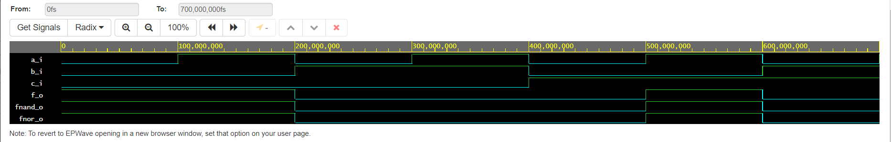
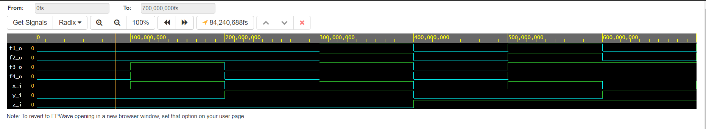

### První úkol
#### De Morgan's laws simulation

```vhdl
architecture dataflow of gates is
begin
    f_o  <= ((not b_i) and a_i) or ((not c_i) and (not b_i));
    fnand_o <= not(not (not b_i and a_i) and not(not b_i and not c_i));
    fnor_o <=not(b_i or not(a_i)) or not(c_i or b_i);
   -- fand_o <= a_i and b_i;
   -- fxor_o <= a_i xor b_i;

end architecture dataflow;
```



#### Odkaz na první úkol
https://www.edaplayground.com/x/R39n

| **c** | **b** |**a** | **f(c,b,a)** |
| :-: | :-: | :-: | :-: |
| 0 | 0 | 0 | 1 |
| 0 | 0 | 1 | 1 |
| 0 | 1 | 0 | 0 |
| 0 | 1 | 1 | 0 |
| 1 | 0 | 0 | 0 |
| 1 | 0 | 1 | 1 |
| 1 | 1 | 0 | 0 |
| 1 | 1 | 1 | 0 |

### Druhý úkol

#### Distributive laws

```vhdl
architecture dataflow of gates is
begin
    --f_o <= ((not y_i) and x_i) or ((not z_i) and (not y_i));
    f1_o  <= ((x_i and y_i) or (x_i and z_i));
    f2_o  <= (x_i and (y_i or z_i));
    f3_o  <= ((x_i or y_i) and (x_i or z_i));
    f4_o  <= (x_i or (y_i and z_i));
  

end architecture dataflow;
``` 

#### Odkaz na druhý úkol
https://www.edaplayground.com/x/NE6z

