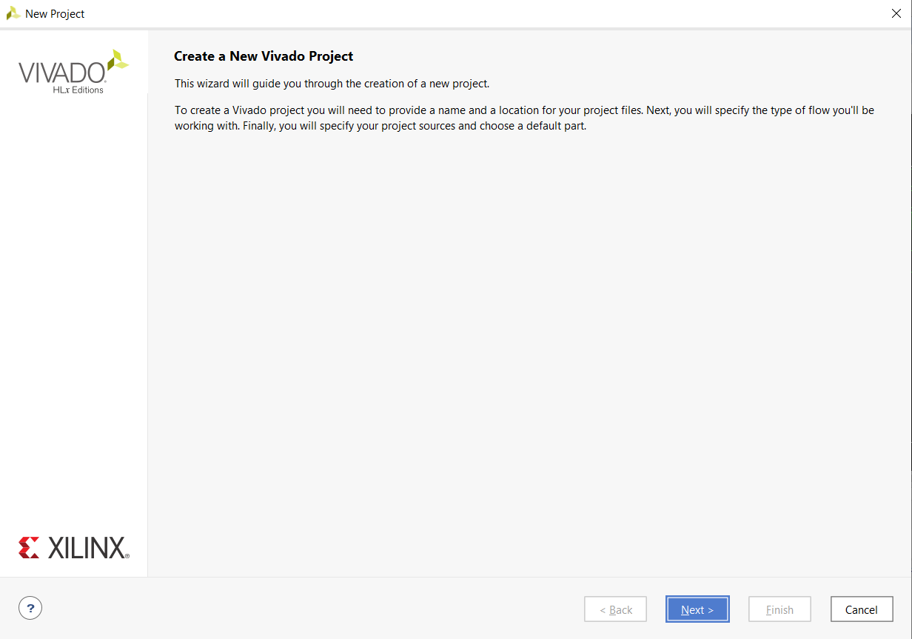

### První úkol


### Druhý úkol


#### mux_2bit_4to1
```vhdl
architecture Behavioral of mux_2bit_4to1 is
begin
    f_O <= a_i when (sel_i="00")else
            b_i when (sel_i="01")else
            c_i when (sel_i="10")else
            d_i;


    -- WRITE "GREATER" AND "EQUALS" ASSIGNMENTS HERE


end architecture Behavioral;
```

#### tb_mux_2bit_4to1

```vhdl
 p_stimulus : process
    begin
        -- Report a note at the beginning of stimulus process
        report "Stimulus process started" severity note;


        -- First test values
        s_d <= "00"; s_c <= "00";s_b <= "00"; s_a <= "00" ;
        s_sel <="00";wait for 100ns;
 
        s_d <= "10"; s_c <= "01";s_b <= "01"; s_a <= "00" ;
        s_sel <="00";wait for 100ns;
        
        s_d <= "10"; s_c <= "01";s_b <= "01"; s_a <= "11" ;
        s_sel <="00";wait for 100ns;
        
        s_d <= "10"; s_c <= "01";s_b <= "01"; s_a <= "00" ;
        s_sel <="01";wait for 100ns;
        
        s_d <= "10"; s_c <= "01";s_b <= "11"; s_a <= "00" ;
        s_sel <="01";wait for 100ns;


        -- Report a note at the end of stimulus process
        report "Stimulus process finished" severity note;
        wait;
    end process p_stimulus;
```

### Třetí úkol - tutoriál

1. Vytvoříme Nový projekt

2. Klikneme na tlačítko next

3. Zadáme Project name

4. Necháme zaškrknutou volbu RTL Project

5. Zadáme typ VHDL a zadáme požadovaný File name

6. Klikneme na Next

7. Zadáme Board Nexys A7-50T

8. Klikneme na tlačítko Finish

9. Zadáme Entity name

10. Klikneme na File - Add Sources

11. Vybereme položku Add or create simulation sources

12. Klikneme na Create file, dále vybereme File typ: VHDL a zadáme File name
